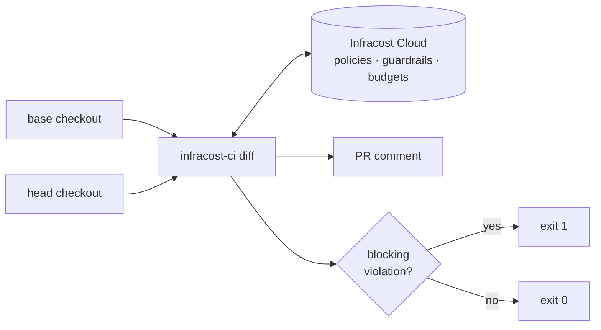
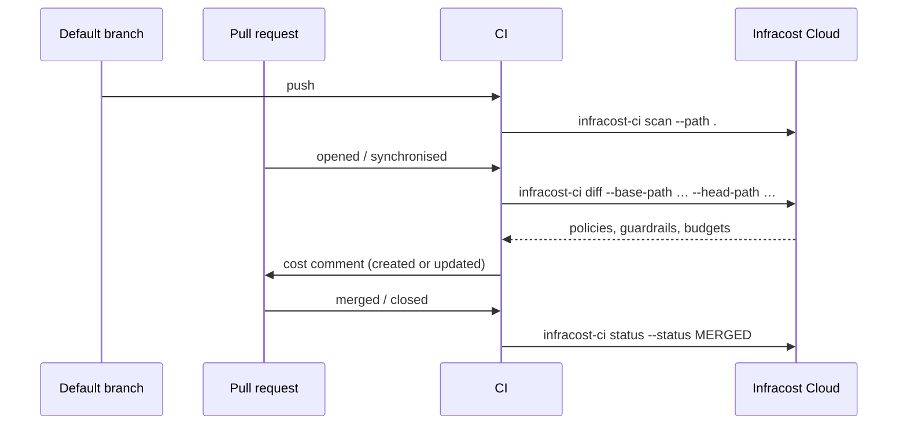

# Infracost CI

Cloud cost estimates for infrastructure code, in your CI pipeline.

`infracost-ci` is a single Go binary — `infracost-ci` inside the container image —
that scans directories of infrastructure
code, calculates the cost difference between two branches, posts a comment on the
pull request, and uploads the run to [Infracost Cloud](https://dashboard.infracost.io).
It embeds the Infracost CLI as a library rather than shelling out to it.

- **Cost diffs on every PR** — what this change does to the monthly bill.
- **Guardrails, budgets and FinOps policies** — evaluated against the head branch, with a non-zero exit when a blocking one trips.
- **Baseline scans** — keep the dashboard current for the default branch.
- **No install step in CI** — the container image ships `git` and every parser and provider plugin.

## How it works



`diff` takes **two checkouts of the same repository** — the base branch and the head
branch — not one path. `scan` is the single-directory command.

Across the life of a pull request:



## Provider support

| Provider | `scan` | `diff` | PR comment | `status` |
| --- | :---: | :---: | :---: | :---: |
| GitHub | ✅ | ✅ | ✅ | ✅ |
| GitLab | ✅ | ✅ | ✅ | ✅ |
| Bitbucket | ✅ | ✅ | ✅ | ✅ |
| Azure Repos | ✅ | ✅ | ✅ | ✅ |

Self-managed servers work: GitHub Enterprise Server, self-managed GitLab, Bitbucket
Data Center and Azure DevOps Server are all derived from the repository URL.

## Getting started

Two secrets, and nothing else. Set an [Infracost API key](https://dashboard.infracost.io)
in `INFRACOST_CLI_AUTHENTICATION_TOKEN`, and a token the provider lets you comment
with. The repository, pull request, branches and run id come from the CI platform's
own variables.

### What is inferred

| Setting | GitHub Actions | GitLab CI | Bitbucket Pipelines | Azure Pipelines | Jenkins |
| --- | --- | --- | --- | --- | --- |
| Detected by | `GITHUB_ACTIONS` | `GITLAB_CI` | `BITBUCKET_*` | `SYSTEM_COLLECTIONURI` | `JENKINS_URL`, `JENKINS_NODE_COOKIE` or `JENKINS_HOME` |
| Provider | `github` | `gitlab` | `bitbucket` | `azure_repos`, or `github` for a repo backed by GitHub or GitHub Enterprise Server | yours to set ‡ |
| Repository URL | `GITHUB_SERVER_URL` + `GITHUB_REPOSITORY` | `CI_PROJECT_URL` | `BITBUCKET_GIT_HTTP_ORIGIN` † | `BUILD_REPOSITORY_URI` | yours to set ‡ |
| Pull request id | event payload | `CI_MERGE_REQUEST_IID` | `BITBUCKET_PR_ID` | `SYSTEM_PULLREQUEST_PULLREQUESTID`, or `SYSTEM_PULLREQUEST_PULLREQUESTNUMBER` on a GitHub-backed repo | `CHANGE_ID` |
| Branch | `GITHUB_HEAD_REF` | `CI_MERGE_REQUEST_SOURCE_BRANCH_NAME` | `BITBUCKET_BRANCH` | `SYSTEM_PULLREQUEST_SOURCEBRANCH` | `CHANGE_BRANCH` |
| Base branch | `GITHUB_BASE_REF` | `CI_MERGE_REQUEST_TARGET_BRANCH_NAME` | `BITBUCKET_PR_DESTINATION_BRANCH` | `SYSTEM_PULLREQUEST_TARGETBRANCH` | `CHANGE_TARGET` |
| Pipeline run id | `GITHUB_RUN_ID` | `CI_PIPELINE_ID` | `BITBUCKET_BUILD_NUMBER` | `BUILD_BUILDID` | `BUILD_TAG`, or `BUILD_NUMBER` |
| Pull request title | event payload | `CI_MERGE_REQUEST_TITLE` | API lookup, needs the comment token | API lookup on Azure Repos, needs the comment token; nothing on a GitHub-backed repo | `CHANGE_TITLE` |
| Pull request author | event payload | `CI_COMMIT_AUTHOR` (commit author) | API lookup, needs the comment token | `BUILD_REQUESTEDFOR`, replaced by the API lookup on Azure Repos | `CHANGE_AUTHOR` (VCS login) |
| Pull request labels | event payload | `CI_MERGE_REQUEST_LABELS` | — | — | — |
| **Comment token — yours to set** | `GITHUB_TOKEN` | `GITLAB_TOKEN` | `BITBUCKET_TOKEN` | `SYSTEM_ACCESSTOKEN` or `AZURE_DEVOPS_EXT_PAT`, or `GITHUB_TOKEN` on a GitHub-backed repo | the one matching the provider you set |

*Event payload* is the `pull_request` object in `GITHUB_EVENT_PATH`: Actions has no
predefined variable for any of those four.

† Bitbucket sets that one to an `http://` URL, which keys a second repository on the
dashboard. The example below overrides it — the one line you still have to copy.

‡ Jenkins is VCS-agnostic and names no host, so set `INFRACOST_VCS_PROVIDER` and
`INFRACOST_VCS_REPOSITORY_URL` yourself — see [Jenkins](#jenkins).

On a branch build with no pull request, the branch falls back to `GITHUB_REF_NAME`,
`CI_COMMIT_BRANCH` and `BUILD_SOURCEBRANCHNAME` respectively, and to `BRANCH_NAME` on
Jenkins. Jenkins sets `BRANCH_NAME` to `PR-42` on a change request and to the tag on a
tag build, so it is used only when neither `CHANGE_ID` nor `TAG_NAME` is set.

Any `INFRACOST_VCS_*` you set yourself wins over the inferred value — see
[Configuration](#configuration). On any other CI platform nothing is inferred, so set
them all. `--debug` prints one line naming what was inferred and what your environment
overrode.

### GitHub Actions

```yaml
name: Infracost
on: [pull_request]

jobs:
  infracost:
    runs-on: ubuntu-latest
    container: ghcr.io/infracost/ci:0.1
    permissions:
      contents: read
      pull-requests: write
    env:
      INFRACOST_CLI_AUTHENTICATION_TOKEN: ${{ secrets.INFRACOST_API_KEY }}
      GITHUB_TOKEN: ${{ secrets.GITHUB_TOKEN }}
    steps:
      - uses: actions/checkout@v4
        with:
          ref: ${{ github.event.pull_request.base.sha }}
          path: base
      - uses: actions/checkout@v4
        with:
          path: head
      - run: infracost-ci diff --base-path base --head-path head
```

The image entrypoint is `infracost-ci`, but a `container:` job replaces it with its own
shell — so the step names the binary rather than passing a subcommand to the image.

On GitHub Enterprise Server nothing extra is needed: the API URL is derived from the
inferred repository URL. Override it with `--github-api-url` if it differs. That flag
wants the **base** server URL (the shape of `GITHUB_SERVER_URL`), not `GITHUB_API_URL`
— the latter ends `/api/v3`, and `/api/graphql` is appended to whatever it is given.
It is a flag only: `GITHUB_SERVER_URL` is `https://github.com` on github.com, which is
not an API URL.

### GitLab CI

```yaml
infracost:
  image: ghcr.io/infracost/ci:0.1
  rules:
    - if: $CI_PIPELINE_SOURCE == "merge_request_event"
  variables:
    # Full history: the shallow default may not contain the target branch.
    GIT_DEPTH: 0
  script:
    - git fetch origin "$CI_MERGE_REQUEST_TARGET_BRANCH_NAME"
    - git worktree add base "origin/$CI_MERGE_REQUEST_TARGET_BRANCH_NAME"
    - git worktree add head HEAD
    - infracost-ci diff --base-path base --head-path head
```

`INFRACOST_CLI_AUTHENTICATION_TOKEN` and `GITLAB_TOKEN` both go in masked CI/CD
variables. `GITLAB_TOKEN` needs `api` scope to post notes — `CI_JOB_TOKEN` cannot,
so it is deliberately not a fallback.

Self-managed GitLab needs nothing extra: the server URL is derived from
`CI_PROJECT_URL`. A GitLab served from a relative root
(`https://host/gitlab/group/repo`) needs `--gitlab-server-url` and `--gitlab-project`.

To scan the default branch instead, drop the `rules:` and run `scan --path .`.

### Bitbucket Pipelines

```yaml
image: ghcr.io/infracost/ci:0.1

# Full history: the shallow default may not contain the destination branch.
clone:
  depth: full

pipelines:
  pull-requests:
    '**':
      - step:
          name: Infracost
          script:
            # BITBUCKET_GIT_HTTP_ORIGIN is http, so set the https web URL.
            - export INFRACOST_VCS_REPOSITORY_URL="https://bitbucket.org/$BITBUCKET_REPO_FULL_NAME"
            # FETCH_HEAD, not origin/<branch>: the clone has no remote-tracking
            # ref for the destination branch.
            - git fetch origin "$BITBUCKET_PR_DESTINATION_BRANCH"
            - git worktree add base FETCH_HEAD
            - git worktree add head HEAD
            - infracost-ci diff --base-path base --head-path head
  branches:
    main:
      - step:
          name: Infracost baseline
          script:
            - export INFRACOST_VCS_REPOSITORY_URL="https://bitbucket.org/$BITBUCKET_REPO_FULL_NAME"
            - infracost-ci scan --path .
```

Bitbucket ignores the image's entrypoint and runs the `script:` lines itself, so the
line names the binary.

`INFRACOST_CLI_AUTHENTICATION_TOKEN` and `BITBUCKET_TOKEN` both go in secured
repository variables. `BITBUCKET_TOKEN` is a repository or workspace access token
with **pull requests: write** scope, or `user:app-password` for Basic auth.

`BITBUCKET_PR_ID` only exists in a `pull-requests:` pipeline, which is why `diff`
lives there and the branch pipeline runs `scan`.

Bitbucket has no predefined variable for the pull request title or author, so `diff`
reads them from the pull request API with the same `BITBUCKET_TOKEN` it comments with.
The token is required either way: `diff` fails without it.

Bitbucket Data Center: set `INFRACOST_VCS_REPOSITORY_URL` to the
`/projects/<key>/repos/<slug>` web URL, or pass `--bitbucket-repo` and
`--bitbucket-server-url`.

### Azure Pipelines

Azure Pipelines runs against two different repository hosts, and they differ in how a
pull request build is triggered and which token comments with. Both use the same job
container.

Azure starts the job container as `<image> bash -c "sleep infinity"` and execs the
steps into it, so the image entrypoint runs `bash` and `sh` as given and passes
everything else to `infracost-ci`. No `options: --entrypoint` is needed.

|  | Azure Repos | GitHub-backed |
| --- | --- | --- |
| PR build trigger | Build validation branch policy | `pr:` in the YAML |
| Comment token | `SYSTEM_ACCESSTOKEN` | `GITHUB_TOKEN` |
| Inferred provider | `azure_repos` | `github` |

`BUILD_REPOSITORY_PROVIDER` is what `infracost-ci` reads to tell them apart, so neither
recipe declares a provider. `TfsGit`, `GitHub` and `GitHubEnterprise` are recognised:
an Azure pipeline backed by Bitbucket or an external Git remote infers nothing, so set
`INFRACOST_VCS_PROVIDER` and `INFRACOST_VCS_REPOSITORY_URL` yourself there.
there.

#### Azure Repos

```yaml
trigger:
  branches:
    include:
      - main

# No pr: trigger — Azure Repos ignores it. PR builds come from a Build validation
# branch policy on the target branch, which still sets Build.Reason=PullRequest.

jobs:
  - job: infracost
    # diff is a pull request run: a build of the default branch has no target
    # branch to fetch. Run scan --path . there instead.
    condition: eq(variables['Build.Reason'], 'PullRequest')
    container: ghcr.io/infracost/ci:0.1
    steps:
      - checkout: self
        fetchDepth: 0
        # The default drops the auth header, so the fetch below cannot reach a
        # private repository.
        persistCredentials: true
      - script: |
          BRANCH="${TARGET_BRANCH#refs/heads/}"
          git fetch origin "$BRANCH"
          git worktree add base "origin/$BRANCH"
          git worktree add head HEAD
        env:
          # Mapped, not written into the script: Azure substitutes $(...) into
          # the script text, where bash would parse the branch name as code.
          TARGET_BRANCH: $(System.PullRequest.TargetBranch)
      - script: infracost-ci diff --base-path base --head-path head
        env:
          INFRACOST_CLI_AUTHENTICATION_TOKEN: $(INFRACOST_API_KEY)
          SYSTEM_ACCESSTOKEN: $(System.AccessToken)
```

A `pr:` trigger is a GitHub and Bitbucket Cloud feature; on Azure Repos it is ignored
silently and no PR ever queues a build. Wire the pipeline up as a branch policy
instead: **Repos → Branches → `main` → Branch policies → Build validation**.

`SYSTEM_ACCESSTOKEN` must be mapped explicitly — Azure Pipelines does not expose
`System.AccessToken` to a step otherwise. The build identity also needs permission to
comment: **Project Settings → Repositories →** the repo **→ Security**, search
`Build Service`, set **Contribute to pull requests** to Allow. With *Limit job
authorization scope to current project* disabled the pipeline runs as **Project
Collection Build Service** instead, so grant it there.

A personal access token works too, via `AZURE_DEVOPS_EXT_PAT`; only a 52-character PAT
is sent as Basic auth, anything else goes out as a bearer token. `diff` fails without
one of them, and uses it to read the pull request title and author — the only fields
Azure has no variable for.

#### GitHub-backed repository

Azure Pipelines building a GitHub repository. The PR lives on GitHub, so the comment
goes through the GitHub API and `SYSTEM_ACCESSTOKEN` is not involved.

```yaml
# An absent trigger: builds every push to every branch, and the condition below
# then skips the job on each one.
trigger: none

pr:
  branches:
    include:
      - main

jobs:
  - job: infracost
    condition: eq(variables['Build.Reason'], 'PullRequest')
    container: ghcr.io/infracost/ci:0.1
    steps:
      - checkout: self
        fetchDepth: 0
        persistCredentials: true
      - script: |
          BRANCH="${TARGET_BRANCH#refs/heads/}"
          git fetch origin "$BRANCH"
          git worktree add base "origin/$BRANCH"
          git worktree add head HEAD
        env:
          # TargetBranchName is Azure Repos only. Mapped rather than written
          # into the script, which Azure substitutes into before bash parses it.
          TARGET_BRANCH: $(System.PullRequest.TargetBranch)
      - script: infracost-ci diff --base-path base --head-path head
        env:
          INFRACOST_CLI_AUTHENTICATION_TOKEN: $(INFRACOST_API_KEY)
          GITHUB_TOKEN: $(GITHUB_TOKEN)
```

`GITHUB_TOKEN` is a pipeline variable you set, marked **Keep this value secret**: a
fine-grained token scoped to that one repository, with **Pull requests: Read and
write**. A classic PAT works too, but its `repo` scope carries write access to every
repository you can reach. Azure leaves `$(GITHUB_TOKEN)` unexpanded if no such
variable exists, and `diff` refuses that literal rather than sending it to GitHub.

The pull request title is empty on a GitHub-backed repo: the title lookup is Azure
Repos only, and the author is `BUILD_REQUESTEDFOR` — the display name of whoever
queued the build, not the GitHub login. Set `INFRACOST_VCS_PULL_REQUEST_TITLE` and
`INFRACOST_VCS_PULL_REQUEST_AUTHOR` to fill them.

A `pr:` trigger builds pull requests from forks, so leave **Triggers → Pull request
validation → Make secrets available to builds of forks** off; turning it on hands a
stranger's branch both tokens. `persistCredentials: true` writes the checkout token
into `base/.git/config`, inside the tree the scan walks — drop it on a public
repository, where the fetch needs no credential.

The PR number differs between the two hosts: `SYSTEM_PULLREQUEST_PULLREQUESTID` is
Azure-internal, so on a GitHub-backed repo `infracost-ci` reads
`SYSTEM_PULLREQUEST_PULLREQUESTNUMBER`, which is the GitHub number.

### Jenkins

A multibranch pipeline's `CHANGE_*` variables are inferred, so only the provider and
the repository URL are yours to set. Detection keys on `JENKINS_URL`,
`JENKINS_NODE_COOKIE` or `JENKINS_HOME`, whichever the build has: `JENKINS_URL` is
exported only when the Jenkins URL is set under **Manage Jenkins → System**, and
`JENKINS_HOME` is controller state that a Docker agent or a Kubernetes pod template
does not see.

If you set `INFRACOST_VCS_*` variables on an earlier version, delete all but the two
below. An environment value always beats an inferred one, and Groovy renders an unset
`env.CHANGE_BRANCH` as the literal string `null` — which becomes the branch, or fails
the run when `INFRACOST_VCS_PULL_REQUEST_ID` gets it.

```groovy
pipeline {
  agent {
    docker {
      image 'ghcr.io/infracost/ci:0.1'
      // The plugin holds the container open with `cat`, so clear the entrypoint.
      args  '--entrypoint='
    }
  }

  environment {
    INFRACOST_CLI_AUTHENTICATION_TOKEN = credentials('infracost-api-key')
    GITHUB_TOKEN                       = credentials('github-token')
    INFRACOST_VCS_PROVIDER             = 'github'
    INFRACOST_VCS_REPOSITORY_URL       = 'https://github.com/ORG/REPO'
  }

  stages {
    stage('Infracost') {
      when { changeRequest() }
      steps {
        sh '''
          # The workspace is reused between builds, so clear old worktrees.
          git worktree remove --force base || true
          git worktree remove --force head || true
          git worktree prune

          git fetch origin "$CHANGE_TARGET"
          git worktree add base FETCH_HEAD
          git worktree add head HEAD
          infracost-ci diff --base-path base --head-path head
        '''
      }
    }
  }
}
```

Jenkins checks out the pull request ref, so there is no `origin/$CHANGE_TARGET` to
point the base worktree at — hence `FETCH_HEAD`, the ref the fetch just wrote.

Swap `INFRACOST_VCS_PROVIDER` and the token for `gitlab` / `GITLAB_TOKEN`,
`bitbucket` / `BITBUCKET_TOKEN` or `azure_repos` / `AZURE_DEVOPS_EXT_PAT` to match
where the repository lives.

Set `INFRACOST_VCS_REPOSITORY_URL` to the repository **web** URL. `GIT_URL` is a
clone URL and may carry credentials, so it is not a safe substitute.

## Commands

| Command | What it does |
| --- | --- |
| `diff --base-path <dir> --head-path <dir>` | Scan both checkouts, compute the cost diff, post or update the PR comment, upload the run. Exits 1 on a new blocking guardrail or policy violation. Comments on GitHub, GitLab, Azure Repos and Bitbucket. |
| `scan --path <dir>` | Scan one directory and upload a branch run. |
| `status --status OPEN\|MERGED\|CLOSED` | Update the pull request state in the dashboard. |
| `plugins install\|list\|detect` | Install the parser and provider plugins, report their versions, or print the projects they identify. No auth token needed. |

`--tag` sets the marker `diff` uses to find its own comment (default
`infracost-comment`). Changing it on a repository that already has an Infracost
comment means the next run cannot find the old one and posts a second.

Run `infracost-ci <command> --help` for the full flag list. Most VCS metadata
can come from a flag or an `INFRACOST_VCS_*` variable; the flag wins when both are
set. Paths are flags only.

## Configuration

On the four platforms above these are overrides — set one only to correct an inferred
value, or add something the platform does not expose. Everywhere else, set them all.

| Variable | Notes |
| --- | --- |
| `INFRACOST_CLI_AUTHENTICATION_TOKEN` | Required by `diff` and `scan`. |
| `INFRACOST_VCS_PROVIDER` | `github`, `gitlab`, `azure_repos` or `bitbucket`. |
| `INFRACOST_VCS_REPOSITORY_URL` | Repository **web** URL. Never a clone URL with credentials in it. |
| `INFRACOST_VCS_PULL_REQUEST_ID` | PR number. On GitLab this is the project-scoped `iid`. |
| `INFRACOST_VCS_PULL_REQUEST_URL` | Alternative to the ID. Set both and they must agree. |
| `INFRACOST_VCS_BRANCH`, `INFRACOST_VCS_BASE_BRANCH` | Fall back to the checkout's git metadata. |
| `INFRACOST_VCS_PULL_REQUEST_TITLE`, `INFRACOST_VCS_PULL_REQUEST_AUTHOR`, `INFRACOST_VCS_PULL_REQUEST_LABELS` | Shown on the dashboard run. Labels are comma-separated. |
| `INFRACOST_VCS_PIPELINE_RUN_ID` | Links the run back to the CI job. |
| `INFRACOST_CI_DISABLE_DASHBOARD` | Skip uploading results. |
| `INFRACOST_CI_PLATFORM` | Pin the detected platform: `github_actions`, `gitlab_ci`, `bitbucket`, `azure_devops_TfsGit` or `azure_devops_GitHub`. Any other name turns inference off. |
| `GITHUB_TOKEN`, `GITLAB_TOKEN`, `BITBUCKET_TOKEN`, `AZURE_DEVOPS_EXT_PAT` or `SYSTEM_ACCESSTOKEN` | Comment token for the provider `diff` is running against. |
| `INFRACOST_CI_VCS_TLS_CA_CERT_FILE` | PEM bundle trusted in addition to the system pool, for a self-managed VCS behind a private CA. VCS only — the dashboard, pricing and events clients use the system pool. |
| `INFRACOST_CI_VCS_TLS_INSECURE_SKIP_VERIFY` | Skip VCS certificate verification. The token then travels over an unauthenticated connection — prefer the CA file. Warns when on. |

Commit SHA, message, author and timestamp are read from the head checkout when not
set explicitly — which is why `git` must be on `PATH`. The container image has it.

## Installing

### Container (recommended)

The image carries `git` and every plugin, so a job pulls once instead of downloading
~150 MB of plugins on every run.

```bash
docker run --rm -e INFRACOST_CLI_AUTHENTICATION_TOKEN -v "$PWD:/src" -w /src \
  ghcr.io/infracost/ci:latest scan --path .
```

Tags are `latest`, the minor series (`0.1`) and the exact version (`0.1.0`). Only the
exact version is immutable; pin by digest to pin the bytes:

```bash
docker run --rm ghcr.io/infracost/ci@sha256:... --version
```

Each release publishes the manifest-list digest as `image-digest.txt`, and
`docker inspect` reports the plugin versions baked in under the `io.infracost.plugins`
label.

The image defaults to root, which matches what a GitHub Actions `container:` job does
and sidesteps uid mismatches against a mounted workspace. Under a `runAsNonRoot`
policy, give the user a writable home — `infracost-ci` caches there:

```bash
docker run --rm --user 65532 -e HOME=/tmp -e INFRACOST_CLI_AUTHENTICATION_TOKEN \
  -v "$PWD:/src" -w /src ghcr.io/infracost/ci:latest scan --path .
```

`git::` Terraform module sources work; `hg::` sources do not, since Mercurial is not
in the image.

### Binary

Linux and macOS:

```bash
BASE="${INFRACOST_CI_BASE_URL:-${INFRACOST_SCANNER_BASE_URL:-https://github.com/infracost/ci/releases}}"
REF="latest/download"        # or "download/v0.1.0" to pin
OS=$(uname -s | tr '[:upper:]' '[:lower:]')
ARCH=$(uname -m); case "$ARCH" in x86_64) ARCH=amd64 ;; aarch64) ARCH=arm64 ;; esac
SHA=$(command -v sha256sum || echo "shasum -a 256")   # macOS has no sha256sum

# Chained: an unverified archive must never reach tar.
if [ -n "${INFRACOST_CI_BASE_URL:-}" ] || [ -z "${INFRACOST_SCANNER_BASE_URL:-}" ]; then
  ARCHIVE="infracost-ci_${OS}_${ARCH}.tar.gz"
else
  ARCHIVE="infracost-scanner_${OS}_${ARCH}.tar.gz"
fi
curl -fsSL -O "${BASE}/${REF}/${ARCHIVE}" &&
  curl -fsSL -O "${BASE}/${REF}/checksums.txt" &&
  grep " ${ARCHIVE}$" checksums.txt | $SHA -c - &&
  tar -xzf "$ARCHIVE"
```

Windows (PowerShell):

```powershell
# PowerShell 5.1 may default below TLS 1.2, and the progress stream makes a
# multi-megabyte -OutFile download very slow.
[Net.ServicePointManager]::SecurityProtocol = [Net.SecurityProtocolType]::Tls12
$ProgressPreference = "SilentlyContinue"

$Base = if ($env:INFRACOST_CI_BASE_URL) { $env:INFRACOST_CI_BASE_URL } elseif ($env:INFRACOST_SCANNER_BASE_URL) { $env:INFRACOST_SCANNER_BASE_URL } else { "https://github.com/infracost/ci/releases" }
$Ref = "latest/download"     # or "download/v0.1.0" to pin
# An emulated x64 host on ARM64 reports AMD64; ARCHITEW6432 holds the real one.
$Machine = if ($env:PROCESSOR_ARCHITEW6432) { $env:PROCESSOR_ARCHITEW6432 } else { $env:PROCESSOR_ARCHITECTURE }
$Arch = if ($Machine -eq "ARM64") { "arm64" } else { "amd64" }

$Archive = "infracost-ci_windows_$Arch.zip"
Invoke-WebRequest -UseBasicParsing -Uri "$Base/$Ref/$Archive" -OutFile $Archive
Invoke-WebRequest -UseBasicParsing -Uri "$Base/$Ref/checksums.txt" -OutFile checksums.txt

$Expected = (Select-String -Path checksums.txt -Pattern " $Archive$").Line.Split(" ")[0]
$Actual = (Get-FileHash -Algorithm SHA256 $Archive).Hash.ToLower()
if ($Expected -ne $Actual) { throw "checksum mismatch for $Archive" }

Expand-Archive -Path $Archive -DestinationPath . -Force
```

Assets are `infracost-ci_<os>_<arch>.tar.gz` (linux, darwin),
`infracost-ci_windows_<arch>.zip` and `checksums.txt`. Set
`INFRACOST_CI_BASE_URL` to serve the same layout from your own mirror;
`INFRACOST_SCANNER_BASE_URL` remains supported for existing installations.
`checksums.txt` comes from the same host as the archive, so verification proves the
download was not corrupted — not that the host is honest. Only point it at a host
you trust.

Binary installs need `git` on `PATH`, and the first run downloads the plugins.

## Development

```bash
make build            # Build the binary
make test             # Run all tests
make test-unit        # Unit tests only
make test-integration # Integration tests (needs INFRACOST_CLI_AUTHENTICATION_TOKEN)
make lint             # golangci-lint
make mocks            # Regenerate mockery mocks
```

The `Dockerfile` copies a released binary rather than compiling one, so it does not
build from a clean checkout. To build it locally, put a binary where the release
workflow would:

```bash
mkdir -p "dist/$(go env GOARCH)"
CGO_ENABLED=0 go build -o "dist/$(go env GOARCH)/infracost-ci" .
docker build -t infracost-ci:dev .
```

### Cutting a release

Push the tag. Nothing else.

```bash
git tag v0.1.0
git push origin v0.1.0
```

Do not use `gh release create`. The workflow drafts the release itself, builds
into it, verifies, and publishes last. A release that already exists and is
published makes the workflow refuse, because drafting over it would 404 every
pinned download and hand `latest` back to the previous version.

If that happens, delete the release and the tag, then push the tag again:

```bash
gh release delete v0.1.0 --repo infracost/ci --yes
git push --delete origin v0.1.0
```

Pushing a `v*.*.*` tag builds six platforms, attaches `checksums.txt`, publishes the
release, and pushes `ghcr.io/infracost/ci` for `linux/amd64` and `linux/arm64`. The
image is only tagged once the archives and the image have both been verified, so a
rolled-back release leaves nothing behind.

## License

[Apache 2.0](LICENSE)
