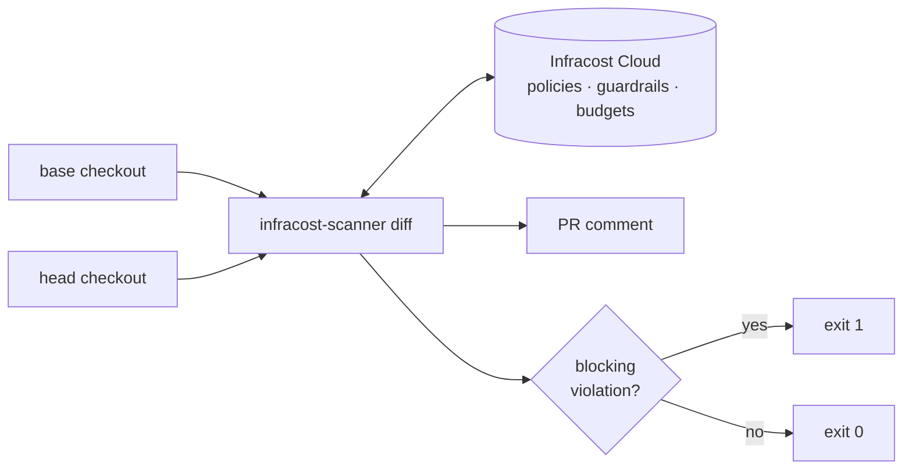
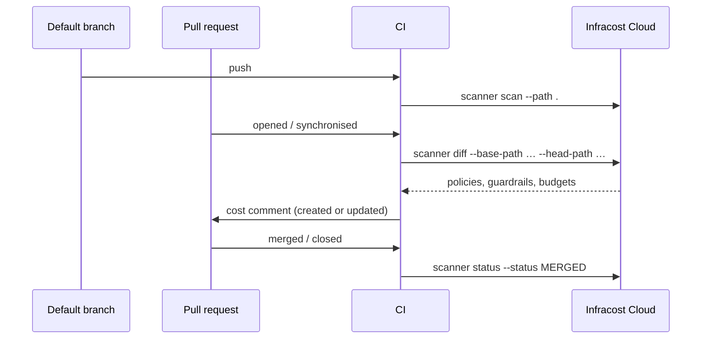

# Infracost CI

Cloud cost estimates for infrastructure code, in your CI pipeline.

`infracost-scanner` is a single Go binary that scans directories of infrastructure
code, calculates the cost difference between two branches, posts a comment on the
pull request, and uploads the run to [Infracost Cloud](https://dashboard.infracost.io).
It embeds the Infracost CLI as a library rather than shelling out to it.

- **Cost diffs on every PR** — what this change does to the monthly bill.
- **Guardrails, budgets and FinOps policies** — evaluated against the head branch, with a non-zero exit when a blocking one trips.
- **Baseline scans** — keep the dashboard current for the default branch.
- **No install step in CI** — the container image ships `git` and every parser and provider plugin.

## How it works



`diff` takes **two checkouts of the same repository** — the base branch and the head
branch — not one path. `scan` is the single-directory command.

Across the life of a pull request:



## Provider support

| Provider | `scan` | `diff` | PR comment | `status` |
| --- | :---: | :---: | :---: | :---: |
| GitHub | ✅ | ✅ | ✅ | ✅ |
| GitLab | ✅ | — | — | ✅ |
| Bitbucket | ✅ | — | — | ✅ |
| Azure Repos | ✅ | — | — | ✅ |

Comment posting is GitHub-only today, and `diff` always posts, so it is GitHub-only
too. Everywhere else, `scan` uploads branch runs and `status` tracks the PR state —
results appear in the dashboard, not in the merge request.

GitHub Enterprise Server is not supported: only `github.com` repositories.

## Getting started

You need an [Infracost API key](https://dashboard.infracost.io) in
`INFRACOST_CLI_AUTHENTICATION_TOKEN`.

### GitHub Actions

```yaml
name: Infracost
on: [pull_request]

jobs:
  infracost:
    runs-on: ubuntu-latest
    container: ghcr.io/infracost/ci:0.1
    permissions:
      contents: read
      pull-requests: write
    env:
      INFRACOST_CLI_AUTHENTICATION_TOKEN: ${{ secrets.INFRACOST_API_KEY }}
      GITHUB_TOKEN: ${{ secrets.GITHUB_TOKEN }}
      INFRACOST_VCS_PROVIDER: github
      INFRACOST_VCS_REPOSITORY_URL: ${{ github.server_url }}/${{ github.repository }}
      INFRACOST_VCS_PULL_REQUEST_ID: ${{ github.event.pull_request.number }}
      INFRACOST_VCS_PULL_REQUEST_TITLE: ${{ github.event.pull_request.title }}
      INFRACOST_VCS_PULL_REQUEST_AUTHOR: ${{ github.event.pull_request.user.login }}
      INFRACOST_VCS_BRANCH: ${{ github.head_ref }}
      INFRACOST_VCS_BASE_BRANCH: ${{ github.base_ref }}
      INFRACOST_VCS_PIPELINE_RUN_ID: ${{ github.run_id }}
    steps:
      - uses: actions/checkout@v4
        with:
          ref: ${{ github.event.pull_request.base.sha }}
          path: base
      - uses: actions/checkout@v4
        with:
          path: head
      - run: infracost-scanner diff --base-path base --head-path head
```

The image entrypoint is the scanner, but a `container:` job replaces it with its own
shell — so the step names the binary rather than passing a subcommand to the image.

### GitLab CI

Merge request comments are not supported yet. Scan the default branch so the
dashboard stays current:

```yaml
infracost:
  image: ghcr.io/infracost/ci:0.1
  variables:
    INFRACOST_VCS_PROVIDER: gitlab
    INFRACOST_VCS_REPOSITORY_URL: $CI_PROJECT_URL
    INFRACOST_VCS_BRANCH: $CI_COMMIT_REF_NAME
    INFRACOST_VCS_PIPELINE_RUN_ID: $CI_PIPELINE_ID
  script:
    - infracost-scanner scan --path .
```

`INFRACOST_CLI_AUTHENTICATION_TOKEN` goes in a masked CI/CD variable.

### Bitbucket Pipelines

```yaml
image: ghcr.io/infracost/ci:0.1

pipelines:
  branches:
    main:
      - step:
          name: Infracost
          script:
            - export INFRACOST_VCS_PROVIDER=bitbucket
            - export INFRACOST_VCS_REPOSITORY_URL="https://bitbucket.org/$BITBUCKET_REPO_FULL_NAME"
            - export INFRACOST_VCS_BRANCH=$BITBUCKET_BRANCH
            - export INFRACOST_VCS_PIPELINE_RUN_ID=$BITBUCKET_BUILD_NUMBER
            - infracost-scanner scan --path .
```

### Azure Pipelines

```yaml
jobs:
  - job: infracost
    container: ghcr.io/infracost/ci:0.1
    steps:
      - checkout: self
      - script: infracost-scanner scan --path .
        env:
          INFRACOST_CLI_AUTHENTICATION_TOKEN: $(INFRACOST_API_KEY)
          INFRACOST_VCS_PROVIDER: azure_repos
          INFRACOST_VCS_REPOSITORY_URL: $(Build.Repository.Uri)
          INFRACOST_VCS_BRANCH: $(Build.SourceBranchName)
          INFRACOST_VCS_PIPELINE_RUN_ID: $(Build.BuildId)
```

`INFRACOST_VCS_REPOSITORY_URL` must be the repository URL containing `/_git/`, not
the project URL.

## Commands

| Command | What it does |
| --- | --- |
| `diff --base-path <dir> --head-path <dir>` | Scan both checkouts, compute the cost diff, post or update the PR comment, upload the run. Exits 1 on a new blocking guardrail or policy violation. |
| `scan --path <dir>` | Scan one directory and upload a branch run. |
| `status --status OPEN\|MERGED\|CLOSED` | Update the pull request state in the dashboard. |
| `plugins install\|list\|detect` | Install the parser and provider plugins, report their versions, or print the projects they identify. No auth token needed. |

Run `infracost-scanner <command> --help` for the full flag list. Most VCS metadata
can come from a flag or an `INFRACOST_VCS_*` variable; the flag wins when both are
set. Paths are flags only.

## Configuration

| Variable | Notes |
| --- | --- |
| `INFRACOST_CLI_AUTHENTICATION_TOKEN` | Required by `diff` and `scan`. |
| `INFRACOST_VCS_PROVIDER` | `github`, `gitlab`, `azure_repos` or `bitbucket`. |
| `INFRACOST_VCS_REPOSITORY_URL` | Repository **web** URL. Required — never a clone URL with credentials in it. |
| `INFRACOST_VCS_PULL_REQUEST_ID` | PR number. On GitLab this is the project-scoped `iid`. |
| `INFRACOST_VCS_PULL_REQUEST_URL` | Alternative to the ID. Set both and they must agree. |
| `INFRACOST_VCS_BRANCH`, `INFRACOST_VCS_BASE_BRANCH` | Fall back to the checkout's git metadata. |
| `INFRACOST_VCS_PIPELINE_RUN_ID` | Links the run back to the CI job. |
| `INFRACOST_CI_DISABLE_DASHBOARD` | Skip uploading results. |

Commit SHA, message, author and timestamp are read from the head checkout when not
set explicitly — which is why `git` must be on `PATH`. The container image has it.

## Installing

### Container (recommended)

The image carries `git` and every plugin, so a job pulls once instead of downloading
~150 MB of plugins on every run.

```bash
docker run --rm -e INFRACOST_CLI_AUTHENTICATION_TOKEN -v "$PWD:/src" -w /src \
  ghcr.io/infracost/ci:latest scan --path .
```

Tags are `latest`, the minor series (`0.1`) and the exact version (`0.1.0`). Only the
exact version is immutable; pin by digest to pin the bytes:

```bash
docker run --rm ghcr.io/infracost/ci@sha256:... --version
```

Each release publishes the manifest-list digest as `image-digest.txt`, and
`docker inspect` reports the plugin versions baked in under the `io.infracost.plugins`
label.

The image defaults to root, which matches what a GitHub Actions `container:` job does
and sidesteps uid mismatches against a mounted workspace. Under a `runAsNonRoot`
policy, give the user a writable home — the scanner caches there:

```bash
docker run --rm --user 65532 -e HOME=/tmp -e INFRACOST_CLI_AUTHENTICATION_TOKEN \
  -v "$PWD:/src" -w /src ghcr.io/infracost/ci:latest scan --path .
```

`git::` Terraform module sources work; `hg::` sources do not, since Mercurial is not
in the image.

### Binary

Linux and macOS:

```bash
BASE="${INFRACOST_SCANNER_BASE_URL:-https://github.com/infracost/ci/releases}"
REF="latest/download"        # or "download/v0.1.0" to pin
OS=$(uname -s | tr '[:upper:]' '[:lower:]')
ARCH=$(uname -m); case "$ARCH" in x86_64) ARCH=amd64 ;; aarch64) ARCH=arm64 ;; esac
SHA=$(command -v sha256sum || echo "shasum -a 256")   # macOS has no sha256sum

# Chained: an unverified archive must never reach tar.
ARCHIVE="infracost-scanner_${OS}_${ARCH}.tar.gz"
curl -fsSL -O "${BASE}/${REF}/${ARCHIVE}" &&
  curl -fsSL -O "${BASE}/${REF}/checksums.txt" &&
  grep " ${ARCHIVE}$" checksums.txt | $SHA -c - &&
  tar -xzf "$ARCHIVE"
```

Windows (PowerShell):

```powershell
# PowerShell 5.1 may default below TLS 1.2, and the progress stream makes a
# multi-megabyte -OutFile download very slow.
[Net.ServicePointManager]::SecurityProtocol = [Net.SecurityProtocolType]::Tls12
$ProgressPreference = "SilentlyContinue"

$Base = if ($env:INFRACOST_SCANNER_BASE_URL) { $env:INFRACOST_SCANNER_BASE_URL } else { "https://github.com/infracost/ci/releases" }
$Ref = "latest/download"     # or "download/v0.1.0" to pin
# An emulated x64 host on ARM64 reports AMD64; ARCHITEW6432 holds the real one.
$Machine = if ($env:PROCESSOR_ARCHITEW6432) { $env:PROCESSOR_ARCHITEW6432 } else { $env:PROCESSOR_ARCHITECTURE }
$Arch = if ($Machine -eq "ARM64") { "arm64" } else { "amd64" }

$Archive = "infracost-scanner_windows_$Arch.zip"
Invoke-WebRequest -UseBasicParsing -Uri "$Base/$Ref/$Archive" -OutFile $Archive
Invoke-WebRequest -UseBasicParsing -Uri "$Base/$Ref/checksums.txt" -OutFile checksums.txt

$Expected = (Select-String -Path checksums.txt -Pattern " $Archive$").Line.Split(" ")[0]
$Actual = (Get-FileHash -Algorithm SHA256 $Archive).Hash.ToLower()
if ($Expected -ne $Actual) { throw "checksum mismatch for $Archive" }

Expand-Archive -Path $Archive -DestinationPath . -Force
```

Assets are `infracost-scanner_<os>_<arch>.tar.gz` (linux, darwin),
`infracost-scanner_windows_<arch>.zip` and `checksums.txt`. Set
`INFRACOST_SCANNER_BASE_URL` to serve the same layout from your own mirror.
`checksums.txt` comes from the same host as the archive, so verification proves the
download was not corrupted — not that the host is honest. Only point it at a host
you trust.

Binary installs need `git` on `PATH`, and the first run downloads the plugins.

## Development

```bash
make build            # Build the binary
make test             # Run all tests
make test-unit        # Unit tests only
make test-integration # Integration tests (needs INFRACOST_CLI_AUTHENTICATION_TOKEN)
make lint             # golangci-lint
make mocks            # Regenerate mockery mocks
```

The `Dockerfile` copies a released binary rather than compiling one, so it does not
build from a clean checkout. To build it locally, put a binary where the release
workflow would:

```bash
mkdir -p "dist/$(go env GOARCH)"
CGO_ENABLED=0 go build -o "dist/$(go env GOARCH)/infracost-scanner" .
docker build -t infracost-ci:dev .
```

Pushing a `v*.*.*` tag builds six platforms, attaches `checksums.txt`, publishes the
release, and pushes `ghcr.io/infracost/ci` for `linux/amd64` and `linux/arm64`. The
image is only tagged once the archives and the image have both been verified, so a
rolled-back release leaves nothing behind.

## License

[Apache 2.0](LICENSE)
